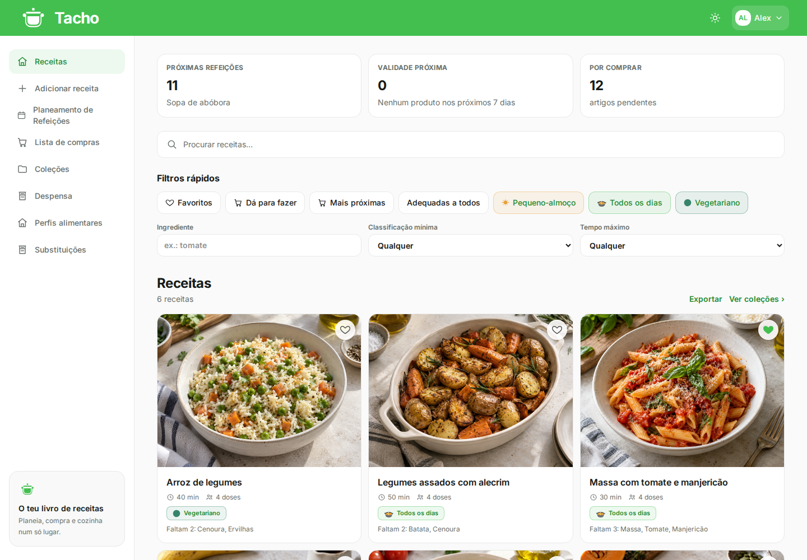
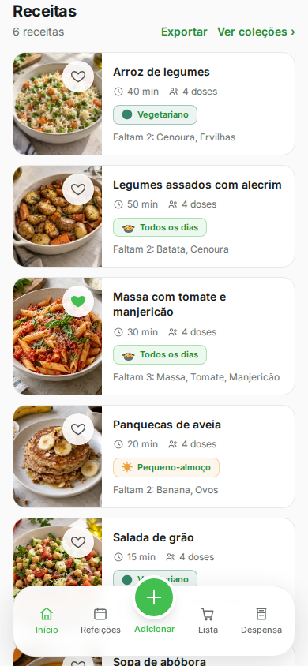
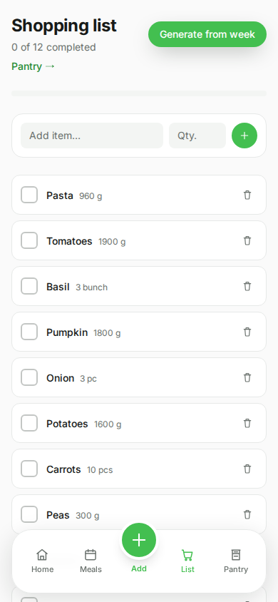
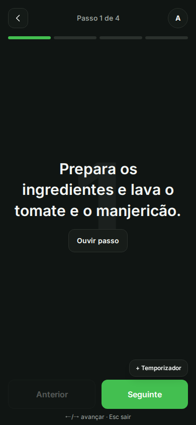
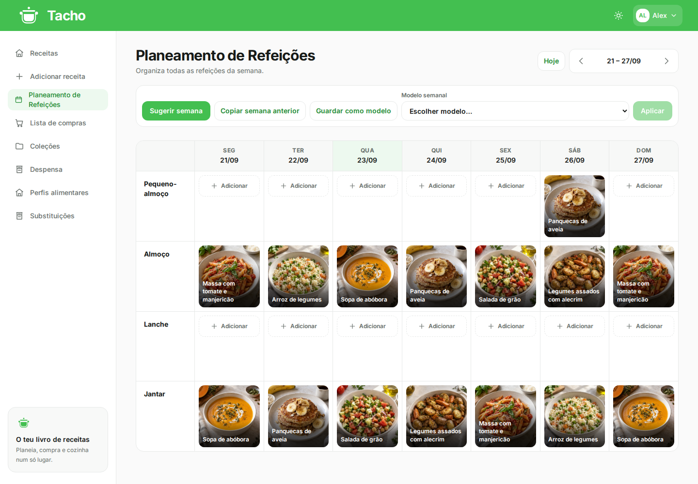
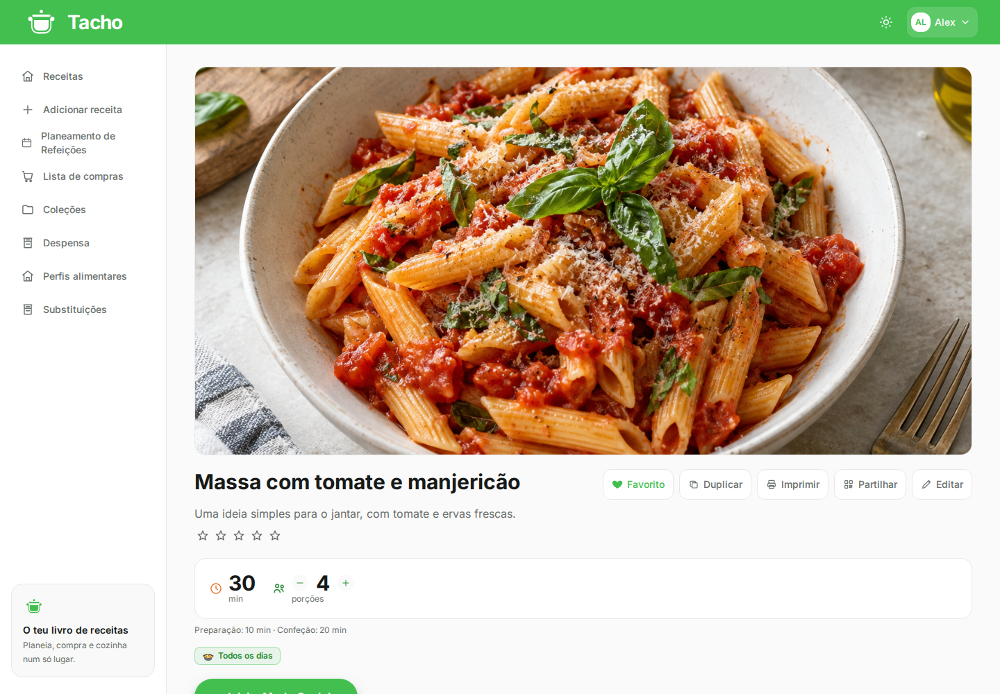
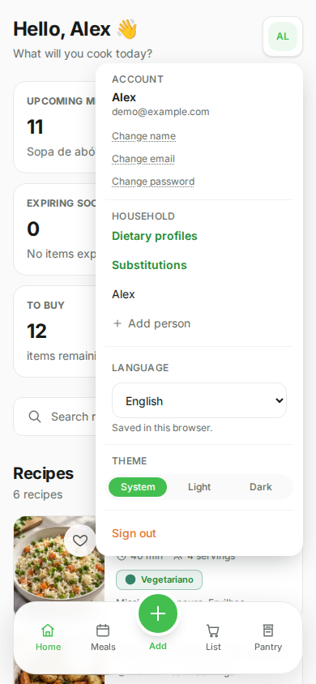
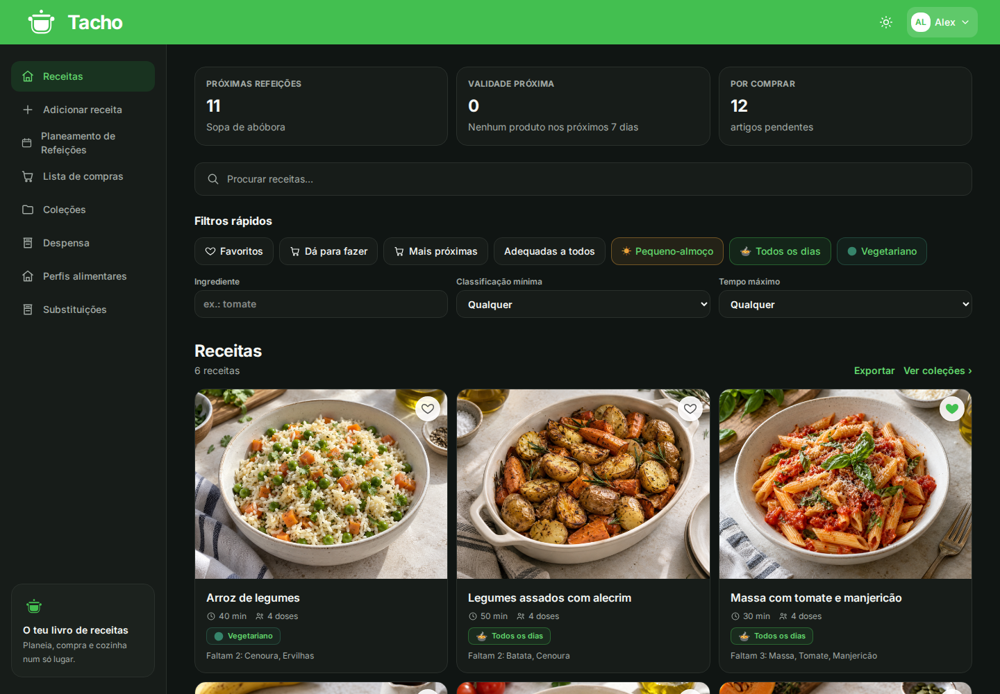

<p align="center">
  
</p>

<h1 align="center">Tacho</h1>
<p align="center"><strong>From saved recipes to dinner on the table.</strong></p>
<p align="center">
  Your recipes, weekly meals and shared shopping list, together.<br />
  On your computer, on your phone, and on your own server.
</p>

<p align="center">
  <a href="https://github.com/11VitorAlves11/tacho/releases"></a>
  <a href="https://github.com/11VitorAlves11/tacho/actions/workflows/ci.yml"></a>
  <a href="LICENSE"></a>
  
</p>

<p align="center">
  <a href="#the-interface">See the interface</a> ·
  <a href="#features">Features</a> ·
  <a href="#install">Install</a> ·
  <a href="https://github.com/11VitorAlves11/tacho/releases">Releases</a> ·
  <a href="CONTRIBUTING.md">Contribute</a>
</p>

<p align="center">
  <a href="docs/images/desktop-home.png"></a>
</p>

## What is Tacho?

Tacho is an open source, self-hosted recipe and kitchen manager for a household. Save the
recipes you want to cook, organise them into collections, plan the week and turn those plans
into a shared shopping list. When it is time to cook, open a recipe in step-by-step cooking mode.

It works as a website on desktop and mobile, and as an **installable PWA on iPhone and
Android**. Choose **European Portuguese or English** in the account settings, alongside
light, dark and system themes. Your language preference is saved in the current browser.
Recipes, accounts and uploaded photographs live on your own server.

## The interface

These are real browser screenshots of a disposable installation, populated with fictional
household data, original example recipe text and AI-generated food images uploaded to all
six recipes before capture. Click an image to view it full size.

### On a phone

Browse your recipes, tick off the shopping list and follow one cooking step at a time.

<table>
  <tr>
    <th align="center">Your recipe book</th>
    <th align="center">Shopping together</th>
    <th align="center">Cooking mode</th>
  </tr>
  <tr>
    <td width="33%" align="center"><a href="docs/images/mobile-home.png"></a></td>
    <td width="33%" align="center"><a href="docs/images/mobile-shopping.png"></a></td>
    <td width="33%" align="center"><a href="docs/images/mobile-cooking.png"></a></td>
  </tr>
</table>

*Captured in Chromium with mobile emulation at 390 × 844. These are browser captures,
not screenshots of an installed PWA.*

### On a computer

See the whole week at once. Assign recipes to meals, copy a week, save a template or set
recurring meals, then generate the ingredients you need to buy.

<p align="center">
  <a href="docs/images/desktop-meal-plan.png"></a>
</p>

### From recipe to cooking

Keep the cover photo, ingredients, portions and preparation steps together. Add missing
ingredients to your shopping list, or start cooking mode when you are ready.

<p align="center">
  <a href="docs/images/desktop-recipe.png"></a>
</p>

### Make it yours

Open your avatar in the top corner to access **Settings → Language** (or **Definições →
Idioma**). Switch between **Português (Portugal)** and **English** immediately, without
leaving the page. Recipe text stays as you wrote it. Language and theme choices are local
to each browser, so household members can use different preferences.

<p align="center">
  <a href="docs/images/mobile-settings.png"></a>
</p>

<details>
  <summary><strong>See the dark theme</strong></summary>
  <p align="center"><a href="docs/images/desktop-dark.png"></a></p>
</details>

## Features

| | What you can do |
|---|---|
| **Recipe book** | Create and edit recipes with ingredients, steps, photographs and galleries. Organise them with categories, tags and collections; keep favourites and ratings. |
| **Import and export** | Import recipes from supported websites. Export individual recipes as schema.org data or the household recipe collection as versioned JSON. Optional Gemini extraction handles text and photographs. |
| **Cooking mode** | Follow steps in a full-screen view, use timers and scale portions. The active recipe can be cached for interruptions in connectivity. |
| **Meal planning** | Assign recipes to the week, copy weeks, save templates, repeat meals and request suggestions. |
| **Shared shopping list** | Generate ingredients from the meal plan, add your own items and mark purchases as complete. |
| **Pantry** | Track quantities, units, expiry dates and minimum stock. Find recipes you can make and see what ingredients are missing. |
| **Household preferences** | Record dietary profiles, review ingredient warnings and keep substitution rules. |
| **Sharing and printing** | Create temporary public recipe links and QR codes, or use print-friendly recipe views. |
| **Language and appearance** | Switch between European Portuguese and English, with localised dates and light, dark or system themes. Preferences are remembered in each browser. |
| **Accounts** | Add household members, sign in with a password, connect OIDC or configure trusted forward-auth. |

Offline support focuses on the **active cooking recipe**, rather than a complete offline
copy of the household. AI extraction and dietary matching need review before you rely on
their results.

## Install

Needs Docker Engine 24+ and Docker Compose v2.20+, with persistent storage for the database
and uploaded images.

```bash
git clone https://github.com/11VitorAlves11/tacho.git
cd tacho
cp .env.example .env
docker compose up -d --wait
```

Open **[http://localhost:8000](http://localhost:8000)** and create the first account.
Registration closes after initial setup; an authenticated member can add other household
members. The example account shown in the screenshots is not included in a normal installation.

The production stack downloads the published Tacho image, runs migrations and starts the
web application, worker, PostgreSQL and Redis. Database and session secrets are generated
on first start and kept in a persistent volume.

Set `TACHO_PORT` to change the web port. `TACHO_VERSION` selects the image tag; pin an exact
[release](https://github.com/11VitorAlves11/tacho/releases) for predictable upgrades and rollback.

### On your own server

Put Tacho behind an HTTPS reverse proxy and set your public address in `.env`:

```dotenv
PUBLIC_BASE_URL=https://recipes.example.com
SHARE_BASE_URL=https://recipes.example.com
AUTH_COOKIE_SECURE=true
CORS_ORIGINS=["https://recipes.example.com"]
```

Forward requests to Tacho's web port, preserving the original host and protocol headers.
The standard production Compose keeps PostgreSQL and Redis off the host's published ports.
See [installation](docs/installation.md) for setup and verification, and
[configuration](docs/configuration.md) for all settings.

### Installing it on a home screen

Once your instance is reachable over HTTPS:

- **iPhone:** open it in Safari, use the share menu and choose **Add to Home Screen**.
- **Android:** use **Install app** or **Add to Home screen** in a supporting browser.

### Optional integrations

| Integration | Configuration |
|---|---|
| **Gemini extraction** | Set `GEMINI_API_KEY` to enable AI-assisted extraction. Submitted content is processed by Google; manual entry and ordinary website scraping do not require this key. |
| **OpenID Connect** | Set `OIDC_ISSUER`, `OIDC_CLIENT_ID`, `OIDC_REDIRECT_URI` and the client secret if required. The callback is normally `https://your-host/auth/oidc/callback`. |
| **Forward-auth** | Enable `TRUST_FORWARD_AUTH` and configure the shared secret and identity headers on a trusted reverse proxy. |

OIDC uses the authorization-code flow with PKCE. Existing local accounts can be linked
through the account menu; matching email addresses do not automatically link identities.
The [configuration guide](docs/configuration.md) explains provisioning and local-login controls.

## Your data and upgrades

Preserve all three persistent application volumes:

| Compose volume | What it keeps |
|---|---|
| `tacho_pgdata` | Recipes, accounts, meal plans and other application records |
| `tacho_images` | Uploaded recipe photographs |
| `tacho_secrets` | Generated database password and session-signing secret |

These are the volume keys in the Compose file; Docker prefixes their names with the project
name. Keep the secrets with the installation: regenerating them while keeping the database
changes the credentials the application uses to connect.

Before upgrading, create a backup and follow the [upgrade and rollback guide](docs/upgrading.md):

```bash
./scripts/backup.sh
# If you pin TACHO_VERSION, update it in .env to the intended release.
docker compose pull
docker compose up -d --wait
```

The [backup and restore guide](docs/backup-restore.md) covers recovery and verification.
Recipe JSON exports are useful for portability; they do not replace a full installation backup.

## Development and documentation

**FastAPI · SQLAlchemy · Alembic · Celery · PostgreSQL · Redis · React · TypeScript · Vite · Tailwind CSS**

The repository contains one backend and one frontend. Production serves the built frontend
from the API image; the worker and migration jobs use that same release image.

<details>
  <summary><strong>Start the development environment</strong></summary>

From a fresh clone, create `.env` and start the development services:

```bash
cp .env.example .env
docker compose -f docker-compose.dev.yml up --build
```

Frontend: <http://localhost:5173> · API documentation: <http://localhost:8000/docs>

Development uses separate ports for the frontend, backend, database and Redis. If another
stack already uses them, adjust the development port settings and `VITE_API_URL` in `.env`,
plus `DEV_CORS_ORIGINS` when changing the frontend origin.

See [development](docs/development.md) for Python and Node tooling, tests and migrations.

</details>

| Path | Contents |
|---|---|
| [`backend/`](backend/) | API, background tasks, migrations and tests |
| [`frontend/`](frontend/) | Responsive interface, cooking mode and PWA |
| [`scripts/`](scripts/) | Backup, restore and README screenshot tooling |
| [`docs/`](docs/) | Installation, operations, development and application screenshots |

- [Installation](docs/installation.md) and [configuration](docs/configuration.md)
- [Upgrades and rollback](docs/upgrading.md), [backup and restore](docs/backup-restore.md)
- [Development](docs/development.md), [architecture](docs/architecture.md) and [release process](docs/releasing.md)
- [Migration from tacho_app](docs/migration-from-tacho-app.md)
- [How to refresh the README screenshots](docs/screenshots.md)
- [Contributing](CONTRIBUTING.md) and [reporting problems](https://github.com/11VitorAlves11/tacho/issues)
- [Reporting security vulnerabilities privately](SECURITY.md)

Only the latest stable release is supported. General support through GitHub Issues is best-effort.

## Licence

[GNU Affero General Public License v3.0](LICENSE).
